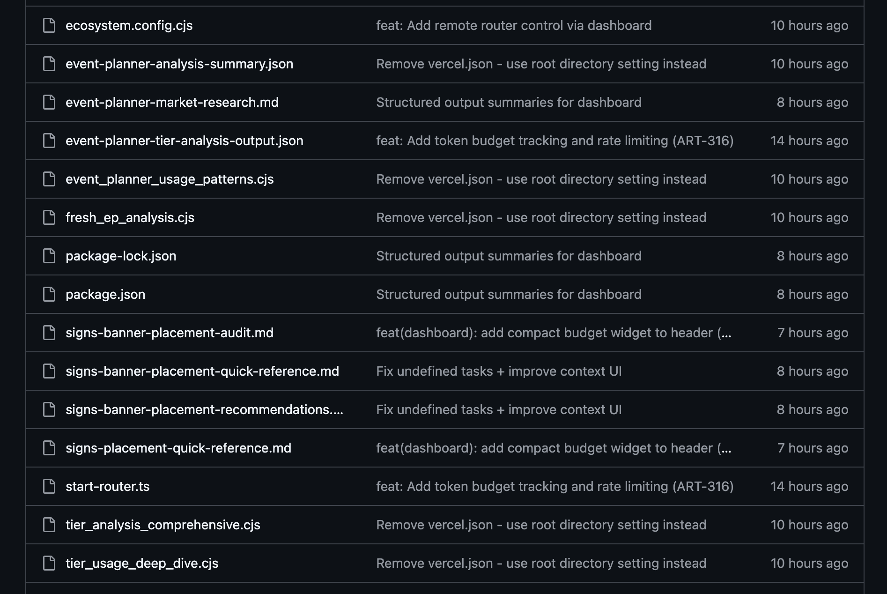

# Artyfacts: Agent Artifact Storage & Viewer

**Version:** 0.1.0-draft  
**Status:** Product Concept  
**Date:** 2026-02-12  
**Company:** Artygroup

---

## Problem Statement

AI agents produce artifacts constantly: research documents, code, analysis, specs, plans. Today these artifacts end up:

1. **Dumped in codebases** — polluting repos with `.md` and `.json` files mixed alongside real code
2. **Trapped on local machines** — inaccessible when you're not on the same device
3. **Unconnected** — no way to trace which artifact led to which decision
4. **Unmanaged** — no lifecycle, no cleanup, everything permanent by default

**Screenshot of the problem:**


---

## Solution: Artyfacts

A hosted service for storing, viewing, and managing agent artifacts.

### Core Value Props

| For | Value |
|-----|-------|
| **Agent operators** | Artifacts accessible from anywhere, not trapped on local machines |
| **Reviewers** | Beautiful UI for reading agent output, not raw markdown in GitHub |
| **Teams** | Shared visibility into what agents are producing |
| **Multi-agent systems** | Clean handoff layer between agents with full lineage tracking |

---

## Architecture

```
┌─────────────────────────────────────────────────────────────────┐
│                         Artyfacts                                │
├─────────────────────────────────────────────────────────────────┤
│                                                                  │
│   ┌──────────────┐    ┌──────────────┐    ┌──────────────┐     │
│   │   Ingest     │    │   Storage    │    │   Viewer     │     │
│   │   API        │───▶│   Layer      │───▶│   UI         │     │
│   └──────────────┘    └──────────────┘    └──────────────┘     │
│          ▲                   │                    │              │
│          │                   ▼                    ▼              │
│   ┌──────────────┐    ┌──────────────┐    ┌──────────────┐     │
│   │  Framework   │    │   Lineage    │    │   Sharing    │     │
│   │  SDKs        │    │   Graph      │    │   & Embeds   │     │
│   └──────────────┘    └──────────────┘    └──────────────┘     │
│                                                                  │
└─────────────────────────────────────────────────────────────────┘
         ▲                                           │
         │                                           ▼
┌─────────────────┐                        ┌─────────────────┐
│  Agent          │                        │  Human          │
│  Frameworks     │                        │  Reviewers      │
│  (Clawdbot,     │                        │  (Browser,      │
│  CrewAI, etc.)  │                        │  Slack, etc.)   │
└─────────────────┘                        └─────────────────┘
```

---

## Components

### 1. Ingest API

REST/GraphQL API for agents to upload artifacts.

**Endpoints:**

```
POST   /v1/artifacts              # Create artifact
GET    /v1/artifacts/:id          # Get artifact
PATCH  /v1/artifacts/:id          # Update artifact metadata
DELETE /v1/artifacts/:id          # Delete artifact

GET    /v1/artifacts              # List/search artifacts
GET    /v1/sessions/:id/artifacts # Artifacts by session
GET    /v1/tasks/:id/artifacts    # Artifacts by task

POST   /v1/artifacts/:id/promote  # Promote to permanent storage
POST   /v1/artifacts/:id/export   # Export to GitHub/Notion/etc.
```

**Upload flow:**

```bash
curl -X POST https://api.artyfacts.dev/v1/artifacts \
  -H "Authorization: Bearer $ARTYFACTS_TOKEN" \
  -H "Content-Type: application/json" \
  -d '{
    "aah_version": "0.1",
    "artifact": {
      "id": "aah_local_123",
      "type": "document/markdown",
      "title": "Competitor Analysis",
      "created_at": "2026-02-11T23:10:28Z"
    },
    "source": {
      "agent_id": "research-agent",
      "framework": "clawdbot",
      "task_id": "ART-456"
    },
    "content": {
      "media_type": "text/markdown",
      "body": "# Competitor Analysis\n\n..."
    },
    "lifecycle": {
      "retention": "30d"
    }
  }'
```

**Response:**

```json
{
  "id": "aah_7f3b2a1c",
  "url": "https://artyfacts.dev/a/7f3b2a1c",
  "embed_url": "https://artyfacts.dev/embed/7f3b2a1c",
  "created_at": "2026-02-11T23:10:30Z",
  "expires_at": "2026-03-13T23:10:30Z"
}
```

---

### 2. Storage Layer

**Requirements:**
- Store artifact metadata (PostgreSQL)
- Store artifact content (S3-compatible blob storage)
- Index for full-text search (Typesense/Meilisearch)
- Graph relationships for lineage (PostgreSQL or Neo4j)

**Data model:**

```sql
-- Core artifact table
CREATE TABLE artifacts (
  id UUID PRIMARY KEY,
  external_id TEXT,              -- Agent-provided ID
  org_id UUID NOT NULL,
  
  -- Artifact metadata
  type TEXT NOT NULL,
  title TEXT,
  summary TEXT,
  
  -- Source
  agent_id TEXT,
  agent_name TEXT,
  agent_role TEXT,
  framework TEXT,
  session_id TEXT,
  task_id TEXT,
  model TEXT,
  
  -- Content
  media_type TEXT NOT NULL,
  content_url TEXT,              -- S3 URL
  content_hash TEXT,
  size_bytes INTEGER,
  token_count INTEGER,
  
  -- Lifecycle
  retention TEXT DEFAULT '30d',
  visibility TEXT DEFAULT 'team',
  status TEXT DEFAULT 'draft',
  expires_at TIMESTAMPTZ,
  
  -- Timestamps
  created_at TIMESTAMPTZ DEFAULT NOW(),
  updated_at TIMESTAMPTZ DEFAULT NOW()
);

-- Lineage relationships
CREATE TABLE artifact_relationships (
  id UUID PRIMARY KEY,
  parent_id UUID REFERENCES artifacts(id),
  child_id UUID REFERENCES artifacts(id),
  relationship_type TEXT DEFAULT 'derived_from',
  created_at TIMESTAMPTZ DEFAULT NOW()
);

-- Tags
CREATE TABLE artifact_tags (
  artifact_id UUID REFERENCES artifacts(id),
  tag TEXT,
  PRIMARY KEY (artifact_id, tag)
);
```

---

### 3. Viewer UI

Web application for browsing and viewing artifacts.

**Pages:**

| Route | Description |
|-------|-------------|
| `/` | Dashboard: recent artifacts, activity feed |
| `/a/:id` | Single artifact view with rendered content |
| `/sessions/:id` | All artifacts from a session |
| `/tasks/:id` | All artifacts related to a task |
| `/agents/:id` | All artifacts from an agent |
| `/graph/:id` | Lineage graph visualization |
| `/search` | Full-text search across artifacts |

**Single artifact view (`/a/:id`):**

```
┌─────────────────────────────────────────────────────────────────┐
│  ← Back to session                                    [Share ▼] │
├─────────────────────────────────────────────────────────────────┤
│                                                                  │
│  Competitor Analysis: Table Management Software                  │
│  ─────────────────────────────────────────────────────────────  │
│  📄 document/markdown  •  4,521 tokens  •  12.8 KB              │
│  Created by research-agent  •  2 hours ago  •  Task ART-456     │
│                                                                  │
│  ┌─────────────────────────────────────────────────────────┐   │
│  │                                                          │   │
│  │  # Competitor Analysis                                   │   │
│  │                                                          │   │
│  │  ## Executive Summary                                    │   │
│  │                                                          │   │
│  │  We analyzed 5 major competitors in the restaurant      │   │
│  │  table management space...                               │   │
│  │                                                          │   │
│  │  ## Competitors                                          │   │
│  │                                                          │   │
│  │  ### 1. OpenTable                                        │   │
│  │  - **Strengths**: Brand recognition, large network      │   │
│  │  - **Weaknesses**: High fees, complex onboarding        │   │
│  │                                                          │   │
│  │  [... beautifully rendered markdown ...]                │   │
│  │                                                          │   │
│  └─────────────────────────────────────────────────────────┘   │
│                                                                  │
│  ┌─────────────┐  ┌─────────────┐  ┌─────────────┐            │
│  │  Lineage    │  │  Raw        │  │  Export     │            │
│  │  (3 linked) │  │  (JSON)     │  │  (GitHub)   │            │
│  └─────────────┘  └─────────────┘  └─────────────┘            │
│                                                                  │
└─────────────────────────────────────────────────────────────────┘
```

**Lineage graph (`/graph/:id`):**

```
┌─────────────────────────────────────────────────────────────────┐
│  Artifact Lineage                                               │
├─────────────────────────────────────────────────────────────────┤
│                                                                  │
│         ┌─────────────────┐                                     │
│         │ Research Brief  │                                     │
│         │ (task input)    │                                     │
│         └────────┬────────┘                                     │
│                  │                                               │
│                  ▼                                               │
│         ┌─────────────────┐                                     │
│         │ Competitor      │  ◀── You are here                   │
│         │ Analysis        │                                     │
│         └────────┬────────┘                                     │
│                  │                                               │
│         ┌───────┴───────┐                                       │
│         ▼               ▼                                       │
│  ┌─────────────┐ ┌─────────────┐                               │
│  │ Feature     │ │ Pricing     │                               │
│  │ Tickets (5) │ │ Strategy    │                               │
│  └─────────────┘ └─────────────┘                               │
│                                                                  │
└─────────────────────────────────────────────────────────────────┘
```

---

### 4. Sharing & Embeds

**Shareable links:**
- `https://artyfacts.dev/a/7f3b2a1c` — Full viewer
- `https://artyfacts.dev/a/7f3b2a1c?token=xyz` — Time-limited public link
- `https://artyfacts.dev/embed/7f3b2a1c` — Embeddable iframe

**Slack unfurling:**

When someone pastes an AAH link in Slack, it unfurls with:
- Title
- Summary/preview
- Agent + timestamp
- Thumbnail (for images/code)

**Export destinations:**
- GitHub (create file in repo)
- Notion (create page)
- Google Docs
- Download as file

---

### 5. Framework SDKs

Native integrations for agent frameworks.

**JavaScript/TypeScript:**

```typescript
import { AAHClient } from '@artyfacts/sdk';

const aah = new AAHClient({ apiKey: process.env.ARTYFACTS_API_KEY });

// Upload artifact
const artifact = await artyfacts.upload({
  type: 'document/markdown',
  title: 'Competitor Analysis',
  content: markdownString,
  source: {
    agentId: 'research-agent',
    taskId: 'ART-456'
  },
  lifecycle: {
    retention: '30d'
  }
});

console.log(`Artifact URL: ${artifact.url}`);
// https://artyfacts.dev/a/7f3b2a1c
```

**Python:**

```python
from artyfacts import AAHClient

aah = AAHClient(api_key=os.environ['ARTYFACTS_API_KEY'])

artifact = artyfacts.upload(
    type='document/markdown',
    title='Competitor Analysis',
    content=markdown_string,
    source={
        'agent_id': 'research-agent',
        'task_id': 'ART-456'
    }
)

print(f"Artifact URL: {artifact.url}")
```

**CLI:**

```bash
# Upload from stdin
cat analysis.md | artyfacts upload --type document/markdown --title "Analysis"

# Upload file
artyfacts upload ./report.md --task-id ART-456

# List recent artifacts
artyfacts list --limit 10

# Open artifact in browser
artyfacts open aah_7f3b2a1c
```

---

## User Flows

### Flow 1: Agent produces artifact

```
1. Agent completes research task
2. Agent calls AAH SDK: artyfacts.upload(content, metadata)
3. AAH stores artifact, returns URL
4. Agent includes URL in its output: "Research complete: https://artyfacts.dev/a/abc123"
5. Human clicks link → sees beautifully rendered artifact
```

### Flow 2: Human reviews agent session

```
1. Human opens AAH dashboard
2. Filters by agent or date range
3. Sees list of artifacts with previews
4. Clicks into artifact → full rendered view
5. Clicks "Lineage" → sees connected artifacts
6. Approves artifact → status changes to "approved"
7. Clicks "Export to GitHub" → artifact becomes permanent
```

### Flow 3: Agent-to-agent handoff

```
1. Research Agent produces analysis artifact with handoff.target_role = "pm"
2. PM Agent queries AAH: "artifacts targeting me"
3. PM Agent retrieves artifact, processes it
4. PM Agent produces tickets, links parent_artifact_ids to the analysis
5. Human can trace: Research → Analysis → Tickets
```

---

## Pricing Model

| Tier | Price | Includes |
|------|-------|----------|
| **Free** | $0 | 100 artifacts/mo, 7-day retention, public links only |
| **Pro** | $20/mo | 2,000 artifacts/mo, 90-day retention, private links, team sharing |
| **Team** | $50/mo | 10,000 artifacts/mo, 1-year retention, SSO, audit logs |
| **Enterprise** | Custom | Unlimited, custom retention, dedicated support, SLAs |

**Add-ons:**
- Permanent storage: $0.10/artifact/month
- Extended retention: $0.01/artifact/day beyond tier limit
- GitHub/Notion sync: Included in Pro+

---

## Integration Roadmap

| Framework | Priority | Status |
|-----------|----------|--------|
| Clawdbot | P0 | Planned |
| LangChain | P1 | Planned |
| CrewAI | P1 | Planned |
| AutoGen | P2 | Planned |
| Custom (API) | P0 | Day 1 |

---

## MVP Scope

**Phase 1 (MVP):**
- [ ] Ingest API (create, get, list)
- [ ] Storage layer (Postgres + S3)
- [ ] Single artifact viewer (rendered markdown, code, JSON)
- [ ] Shareable links
- [ ] Clawdbot SDK integration

**Phase 2:**
- [ ] Session/task grouping views
- [ ] Lineage graph
- [ ] Search
- [ ] Slack unfurling

**Phase 3:**
- [ ] Export to GitHub/Notion
- [ ] Team management
- [ ] Lifecycle automation (auto-expire, auto-promote)
- [ ] Additional framework SDKs

---

## Decisions

1. ✅ **Namespace**: `artyfacts.dev`
2. ⏸️ **Self-hosted option**: Backburner — focus on cloud first
3. ✅ **Content limits**: 10MB for Pro, 100MB for Enterprise
4. ✅ **Deduplication**: Hash-based dedup via SHA-256
5. ✅ **Versioning**: Track versions of the same artifact (see DATA-MODEL.md)

---

## Competitive Landscape

| Product | Focus | Gap |
|---------|-------|-----|
| GitHub | Code storage | Not artifact-native, no lifecycle, wrong UI |
| Notion | Human docs | Not agent-native, heavy structure |
| S3 | Blob storage | No UI, no metadata, no rendering |
| LangSmith | LLM tracing | Traces, not artifacts; eval-focused |
| Arize | ML observability | Model metrics, not agent output |

**Artyfacts positioning**: *"Agent artifacts that you can actually read."*

---

## Next Steps

1. Validate demand: Share spec with agent framework communities
2. Build MVP: Ingest API + viewer + Clawdbot integration
3. Dogfood: Use for Artygroup agent artifacts
4. Iterate: Based on usage patterns
5. Launch: ProductHunt, HN, agent framework discords
